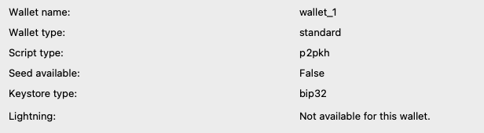
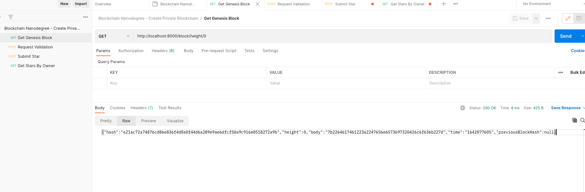
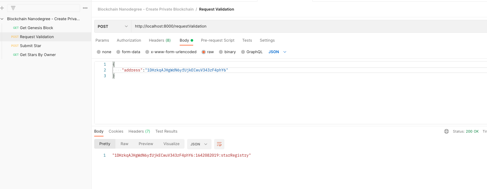
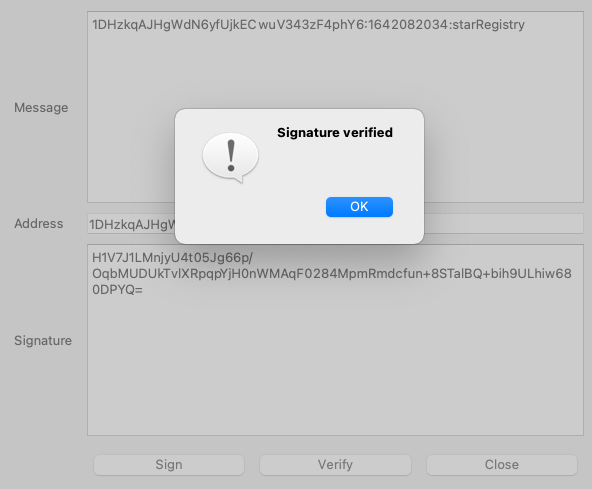
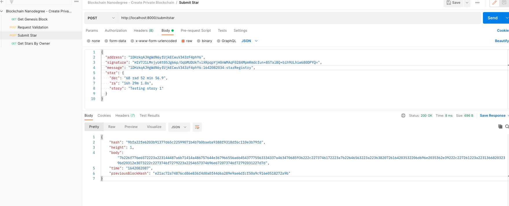
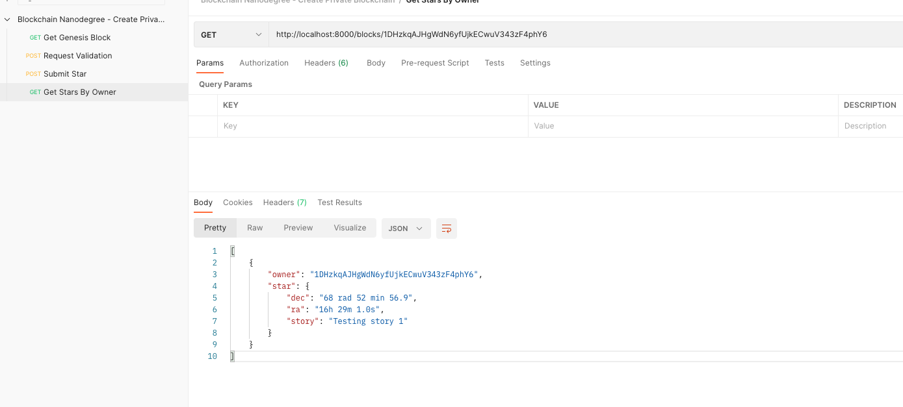
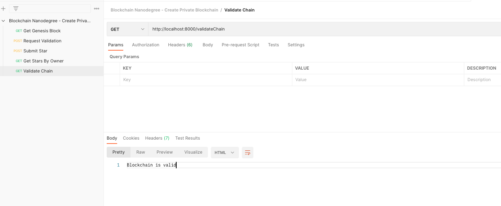

# Private Blockchain Application

This is the submission for 'Create Private Blockchain' project.

## Issues faced during development

* Non-base58 character issue

    This happened due to using wallet of sigwit seed type. If using Electrum, choose to restore/recreate the wallet using the initial list of pass phrases and click 'Options' button to select 'bip32'. Wallet details should show as follows to avoid this error:
    
    

* Several issues with resolving Javascript promises and filters. Had to go over several stackoverflow and google examples to get them right.

* Get URL for Genesis Block is not correct in the boiler plate code. Check the BlockChainController for the correct path.

## Final Screenshots from working app in local

1. Run your application using the command `node app.js`
You should see in your terminal a message indicating that the server is listening in port 8000:
> Server Listening for port: 8000

2. POSTMAN to request the Genesis block:
    
3. Request ownership validation to own wallet address:
    
4. Sign the message with your Wallet:
    
5. Submit Star
     
6. Retrieve Stars owned by me
    
7. Validate Blockchain
    

